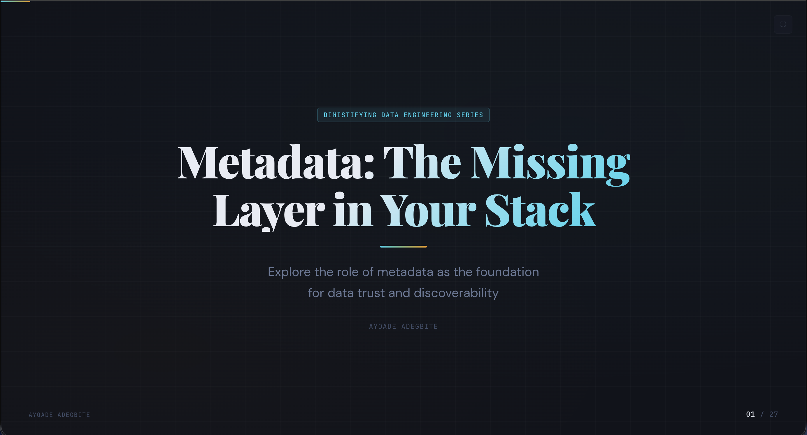
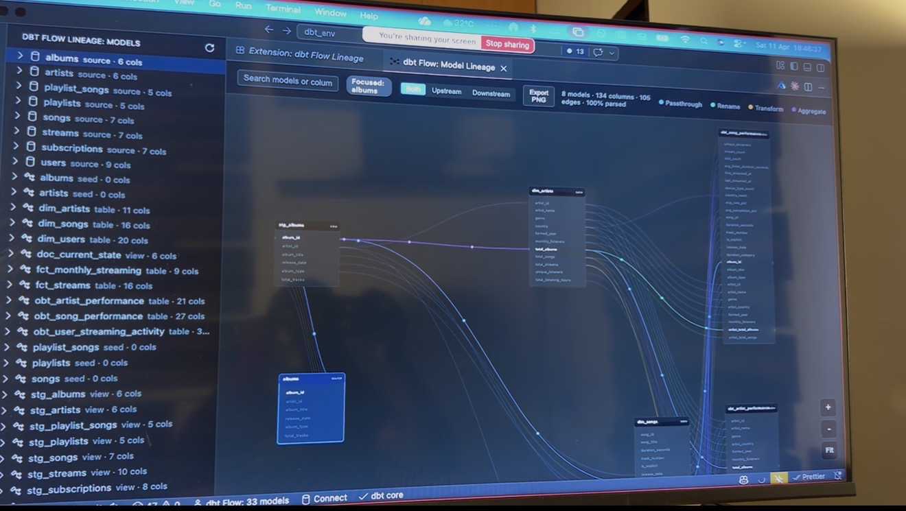

# Metadata: The Missing Layer in Your Stack

> A conference talk on why metadata, not pipelines or transformations is the layer that makes modern data stacks actually usable.

[](https://github.com/tripleaceme/metadata-talk)
[](#)
[](./index.html)

<p align="center">
  
</p>

---

## The Talk

**Your data stack is working.** Pipelines are running. Tables are populated. Dashboards are live.

**But nobody fully understands the data.**

This talk argues that the modern data stack has a missing third layer, and we've been ignoring it. We've optimized infrastructure (warehouses, pipelines) and transformation (dbt, SQL), but we've treated **metadata** as an afterthought.

The result? Tables with no descriptions. Columns named `value_flag` and `col_1`. Tribal knowledge living in Slack threads. Documentation that nobody trusts. Lineage diagrams that show *connections* but not *transformations*.

This isn't a data problem, it's a **metadata problem**.

### What you'll learn

- Why metadata is the **interface between humans and data**
- The four pillars of a healthy metadata layer: **documentation**, **lineage**, **discovery**, and **usage**
- How **column-level lineage** changes debugging and impact analysis (live demo of `[dbt-flow-lineage](https://marketplace.visualstudio.com/items?itemName=tripleaceme.dbt-flow-lineage)`)
- Why **documentation tracking** matters more than documentation itself (intro to `[dbt-doc-tracker](https://hub.getdbt.com/tripleaceme/dbt_doc_tracker/latest) and [dbt-doc-inherit](https://hub.getdbt.com/tripleaceme/dbt_doc_inherit/latest)`)
- The often-ignored fourth pillar: **usage feedback** — closing the loop between docs and consumers
- A practical framework for treating metadata as **infrastructure**, not "nice to have"

### Where it was delivered

Part of the **Demystifying Data Engineering Series**, a community event for analytics engineers, data engineers, and platform teams.

---

## Live from the Webinar

<p align="center">
  
  <br/>
  <em>The dbt Flow Lineage extension shown live — column-level lineage in action across 33 dbt models.</em>
</p>

A short clip from the recording is available at [`webinar/live-recording-clip.mp4`](./webinar/live-recording-clip.mp4).

---

## Slide Deck

The presentation lives in [`index.html`](./index.html) — a self-contained, dependency-free HTML deck with keyboard navigation, swipe support, and a custom dark editorial theme built around a cyan-to-amber gradient system (cold raw data → warm understood data, mirroring the talk's thesis).

### Run it locally

No build step required. Open the file directly:

```bash
open index.html
# or just double-click it
```

### Navigate

| Action            | Keys                                            |
| ----------------- | ----------------------------------------------- |
| Next slide        | `→` &middot; `Space` &middot; `Enter` &middot; click right third |
| Previous slide    | `←` &middot; `Backspace` &middot; click left third |
| First / last      | `Home` &middot; `End`                            |
| Fullscreen toggle | `F`                                             |
| Touch             | Swipe left / right                              |

### Slide structure (27 slides)

| #  | Slide                                            |
| -- | ------------------------------------------------ |
| 1  | Title                                            |
| 2  | About the speaker                                |
| 3  | Behind The Data Newsletter                       |
| 4  | Opening hook — your stack is working...          |
| 5  | Relatable problem — `value_flag`, `col_1`        |
| 6  | Core idea — pipelines move data, metadata makes it usable |
| 7  | The missing third layer                          |
| 8  | What is metadata, really?                        |
| 9  | Why it matters                                   |
| 10 | Where things break                               |
| 11 | Documentation problems                           |
| 12 | What good documentation looks like               |
| 13 | Lineage problems                                 |
| 14 | What can you *actually* see? (talk track for demo) |
| 15 | dbt Flow Lineage video demo                      |
| 16 | Discovery problems                               |
| 17 | Usage blindness — the fourth pillar              |
| 18 | The real problem                                 |
| 19 | What good looks like                             |
| 20 | Documentation as a system (`dbt-doc-tracker`)    |
| 21 | Lineage as a debugging tool                      |
| 22 | Discovery (solution)                             |
| 23 | Usage feedback (advanced insight)                |
| 24 | The big shift                                    |
| 25 | Final thought                                    |
| 26 | Call to action                                   |
| 27 | Thank you                                        |

---

## Tools Featured

| Tool                                                 | What it does                                                  |
| ---------------------------------------------------- | ------------------------------------------------------------- |
| **[dbt Flow Lineage](https://marketplace.visualstudio.com/items?itemName=tripleaceme.dbt-flow-lineage)** | VS Code / browser extension for column-level dbt lineage with impact analysis |
| **[dbt Doc Tracker](https://hub.getdbt.com/tripleaceme/dbt_doc_tracker/latest)**  | Tracks documentation changes across dbt projects: flags stale, inconsistent, or undocumented models |
| **[dbt Doc Inherit](https://hub.getdbt.com/tripleaceme/dbt_doc_inherit/latest)**  | Simplify documentation consistencies across models and dbt-mesh projects |

---

## Speaker

[**Ayoade Adegbite**](https://ayoadeabel.tech/) — Senior Analytics Engineer, international speaker, open-source contributor, founder of [Behind The Data Newsletter](https://behindthedata.substack.com),
[BI Analytics Africa](http://bianalytics.africa/).


### Connect

- LinkedIn — [linkedin.com/in/tripleaceme](https://linkedin.com/in/tripleaceme)
- GitHub — [github.com/tripleaceme](https://github.com/tripleaceme)
- Twitter / X — [@abel_analytics](https://twitter.com/abel_analytics)
- Newsletter — [behindthedata.substack.com](https://behindthedata.substack.com)
- Portfolio - [Ayoade Adegbite](https://ayoadeabel.tech/)
- Speaking — [sessionize.com/ayoade](https://sessionize.com/ayoade)

---

## Repository Contents

```
metadata-talk/
├── index.html                        # The slide deck (open in any browser)
├── README.md                         # You are here
├── Ayoade.jpg                        # Speaker photo (slide 2)
├── behindthedatanews_logo.jpeg       # Newsletter logo (slide 3)
├── demo-obt-lineage.jpeg             # dbt Flow Lineage screenshot (reference)
├── dbt-flow-lineagepreview.mp4       # dbt Flow Lineage demo video (slide 15)
├── Metadata.jpeg                     # Promotional graphic
└── webinar/
    ├── title-slide-live.png          # Title slide displayed during the webinar
    ├── live-presentation.jpg         # dbt Flow Lineage demo on screen during the talk
    └── live-recording-clip.mp4       # Short clip from the live recording
```

---

## Want this talk at your event?

I speak at conferences, meetups, and internal team events on metadata, analytics engineering, and building trustworthy data systems. Reach out via [LinkedIn](https://linkedin.com/in/tripleaceme) or book through [Portfolio](https://ayoadeabel.tech/).

---

<p align="center">
  <em>Pipelines move data. Metadata makes it usable.</em>
</p>
